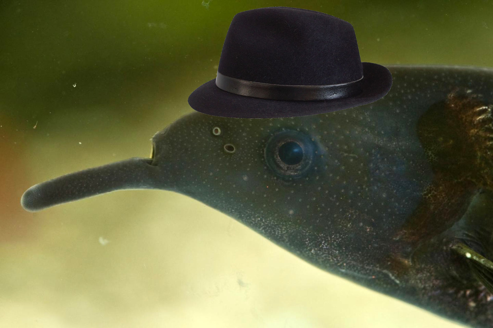

# Elephant-Fish



# Dependencies

These dependencies will be needed for this project to work:
* Python 3.6.10
* sklearn
* numpy
* python
* imageio
* seaborn
* matplotlib
* scipy
* h5py
* sys
* math
* itertools
* os
* opencv2 4.3.0.36 (opencv-python)
* itertools
* keras
* tensorflow
* random
* shap
* collections
* kneed


# Workflow

1. Install all dependencies
2. Get the fishdata
3. Train specific Network on fishdata using this command `[to be written]`
4. Simulate specific Network using this command `[to be written]`
5. Convert simulation output to trackset using this command `[to be written]`
6. Evaluate simulation by using `evaluation.create_plots(tracksets)`
7. Happy evaluating!

Maybe: Do everything at once using this command `[]`

# Given Videos

## Video Mapping

We mapped following names to the given videos:

```
diff_1 - DiffGroup1-1
diff_2 - DiffGroup5_2-cut
diff_3 - DiffGroup9_1-1
diff_4 - DiffGroup9_3-1
diff_5 - DiffGroup31_3-Cut
same_1 - SameGroup5_1-1
same_2 - SameGroup5_3-1
same_3 - SameGroup9_2-1
same_4 - SameGroup31_1-1
same_5 - SameGroup31_2-1
```

## Frames used

```
diff_1: entire video
diff_2: entire video
diff_3: frame 0 - 17000
diff_4: frame 120 - end
diff_5: not used
same_1: entire video
same_2: not used
same_3: frame 130 - end
same_4: entire video
same_5: entire video
```

# General Information

## Bin Representation of Locomotion

For our model input and output of locomotion was in the form of bin representation.\
This means that a given locomotion, e.g. linear movement of 3 is matched to bins, say bin 2 and 5 where 2 has a higher percentage cause it represents the locomotion better.\
We used this form of locomotion representation because movement of fishes is not deterministic and there is not just one right output value for each input, but there is a distribution over the possible locomotion.\
However this leaves one with a decision to which bin centers should be used and how many one should use.\
For the problem of how which center points to use, we decided that it would make sense to apply kmeans to our given locomotion from the videos, giving us higher precision in sections where a lot of movement occured.\
Now for the problem of how many center points to use, we had an objective to use as few center points as possible, that still lead to an acceptable amount of loss of information. After considering plots of locomotion, we decided that at least at 8 bins should be used for linear movement and for change in orientation (this basically gives us a wasd-keyboard for change in orientation and enough bins to have certain speeds of going forward and backward) and at least 16 for the angular change (this plot was a lot more evenly distributed, than the orientation plot, which lead us to to the belief that this one needs more ways of moving)\
Now we had the minimum number of bins to use, however this would probably not be that good. We plotted the loss of information vs count of clusters and used a method to find the elbow of that curve (point that has the maximum curvature). (see figures/cluster_plots) And this gives us kind of an optimal value for how many cluster centers to use. We decided to set a max value of 50 cluster centers, the loss of information stagnated at about that point.

##### TL;DR We used a bin representation of locomotion (using kmeans as centers) and used 18 bins for linear movement, 17 for change in orientation and 26 for angular change.

## Raycasts

In this master thesis https://www.mi.fu-berlin.de/inf/groups/ag-ki/Theses/Completed-theses/Master_Diploma-theses/2019/Maxeiner/MA-Maxeiner.pdf it is explained how raycasts were done. It can be found under section 3.2.2 and 3.2.3

## Locomotion

The locomotion for each timestep is represented with 3 variables, given center and head at timestep t-1 and t:\
first let us define the look vector: the look vector is defined as the subtraction of the head node - the center node (basically the direction in which the fish is looking)\
-linear movement, which is the distance between the center point at t-1 and t\
-angular movement, which is the angle between the look_vector at timestep t-1 and the vector from the center at t-1 to the center at t\
-orientational movement, which is the angle between the look_vector at timestep t-1 and the look_vector at timestep t\

## Future improvements

Improvements we did not invest time in, since the data retrieval was not the main focus of this software project.

* More training on data in sleap (probably 200 - 600 frames more), specifically for edge cases
* Better interpolation method:
* Detect outliers not by constant velocity but rather by a factor depending on the current velocity
* Detect "really bad sequence" of frames more reliably
* Include consistency checks on Nodes in relation to each other (e.g. center needs to be between tail and head, and many more)

# Visualization

Make sure to have opencv 4.3.0 set up correctly, also set up ffmpeg/gstreamer.

## Tracksets on Videos

```
visualization.addTracksOnVideo( inputvideo, outputvideo, tracks, nfish = 3, fps=30, dimension=(960,720), psize=1, showvid=False, skeleton=None )

inputvideo: path to inputvideo
outputviedo: path to outputvideo
tracks: trackset with tracks for every frame of inputvideo
nfish: number of fish in trackset
psize: size of the points put on fish
showvid: show video while rendering (for debugging)
skeleton: A mapping of indices to connect points with lines,
    e.g. trackset with rows: [head1_x, head1_y, center1_x, center1_y, head2_x, ...]
    to connect center and head give [(0,1)]

    for full trackset (10 nodes per fish) use this:
    [(0,1), (0,2), (0,3), (1,2), (1,3), (2,4), (3,5), (2,6), (3,7), (6,8), (7,8), (8,9)]
```

## Tracksets on Tank

```
visualization.addTracksOnTank( outputvideo, tracks, tank="data/tank.png", nfish = 3, fps=30, dimension=(960,720), psize=1, showvid=False, skeleton=None )

outputviedo: path to outputvideo
tracks: trackset with tracks for every frame of inputvideo
tank: tank picture in background
nfish: number of fish in trackset
psize: size of the points put on fish
showvid: show video while rendering (for debugging)
skeleton: A mapping of indices to connect points with lines,
    e.g. trackset with rows: [head1_x, head1_y, center1_x, center1_y, head2_x, ...]
    to connect center and head give [(0,1)]

    for full trackset (10 nodes per fish) use this:
    [(0,1), (0,2), (0,3), (1,2), (1,3), (2,4), (3,5), (2,6), (3,7), (6,8), (7,8), (8,9)]
```

## Fish emplacement

If only given center and head values, you can use
```
@TODO
```
to add static positions for the fish.

# n Node Model

n stands for the amount of nodes

## The nloc model

Datastructure to represent movement. n stands for the amount of nodes per fish
* The first three arguments provide the change from the old center point to the new one
* From that point the base fish model will be computed on
* The rest (n - 1) * 2 arguments are the distance and orientation to the center node

This is how an nloc array looks:
```
[
    [f1_lin, f1_ang, f1_ori, f1_1_dis, d1_1_ori, f1_2_dis, f1_2_ori, ..., f2_lin, f2_ang, f2_ori, ... ]
    ...
]
```

## The nView

Datastructure to represent the view of a fish. A fish in the n Node Model views n nodes for every other fish. This is possible since we are only using 3 fishes constantly.
The nView vector saves the distances and angles from the center of the fish to the n nodes of every other fish.

This is how an nView array looks like for fish1:
```
[
    [f2_n1_dis, f2_n1_ang, f2_n2_dis, f2_n2_ang, ..., f3_n1_dis, f3_n1_ang, ...]
]
```

## Input

The fish gets as input:
* Wall rays
* nView
* nLoc from previos timestep
The fish gives as output:
* The nloc for that timestep
